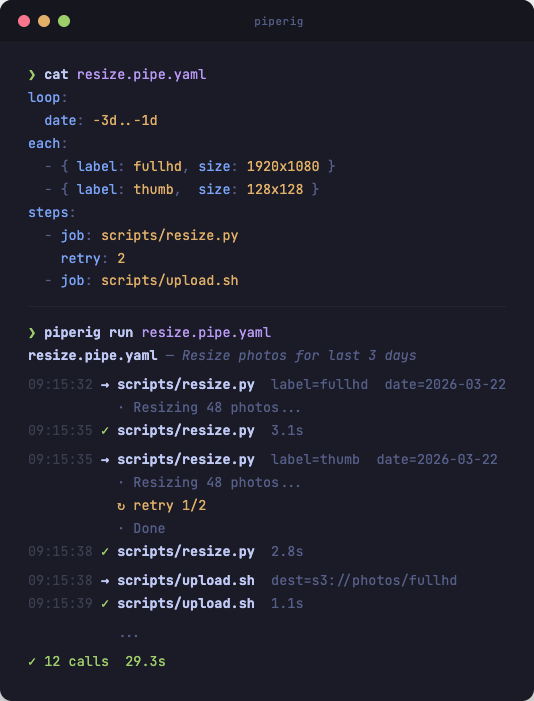

# piperig

[](https://github.com/joarhal/piperig/actions/workflows/ci.yml)
[](https://github.com/joarhal/piperig/releases)
[](https://go.dev/)
[](LICENSE)

Run your scripts as declarative YAML pipelines — with loops, date ranges, retries, and scheduling.

<p align="center">
  
</p>

Single binary, no runtime dependencies. Your scripts do the work — piperig connects them.

```yaml
steps:
  - job: scripts/fetch.sh          # bash scripts/fetch.sh
  - job: scripts/transform.py      # python scripts/transform.py
  - job: scripts/upload.js         # node scripts/upload.js
  - job: bin/notify                 # ./bin/notify (direct exec)
```

Any language. piperig picks the interpreter by extension (`.py` → python, `.sh` → bash, `.js` → node, `.ts` → npx tsx, `.rb` → ruby). No extension means direct exec. Add custom ones in [`.piperig.yaml`](#project-config).

## Install

**Homebrew:**

```bash
brew install joarhal/tap/piperig
```

**Go:**

```bash
go install github.com/joarhal/piperig/cmd/piperig@latest
```

## Usage

**Create from template:**

```bash
piperig new pipe pipes/daily/images    # → pipes/daily/images.pipe.yaml
```

Edit the generated file — add your scripts, parameters, and loops.

**Create with AI.** Ask your LLM to run `piperig llm` to read the full documentation, then ask it to create `.pipe.yaml` files for your scripts.

**Run:**

```bash
piperig run pipes/daily/images.pipe.yaml             # run a pipe
piperig run pipes/daily/images.pipe.yaml quality=90   # run with override
piperig check pipes/daily/images.pipe.yaml            # preview the call plan
piperig run                                           # interactive picker
```

## Demo

```yaml
# news.pipe.yaml
description: Collect and summarize news for last 3 days

with:
  output_dir: ./news

loop:
  date: -3d..-1d

each:
  - { source: hackernews, topic: programming }
  - { source: reddit,     topic: tech }

steps:
  - job: scripts/fetch_articles.py
    retry: 2
    retry_delay: 3s
  - job: scripts/summarize.py
  - job: scripts/send_digest.sh
    each: false
    loop: false
    allow_failure: true
```

```bash
$ piperig check news.pipe.yaml

Pipe: news.pipe.yaml (Collect and summarize news for last 3 days)

  Step 1: scripts/fetch_articles.py × 2 each × 3 date = 6 calls
    1. output_dir=./news  source=hackernews  topic=programming  date=2026-03-18
    2. output_dir=./news  source=hackernews  topic=programming  date=2026-03-19
    3. output_dir=./news  source=hackernews  topic=programming  date=2026-03-20
    4. output_dir=./news  source=reddit      topic=tech         date=2026-03-18
    5. output_dir=./news  source=reddit      topic=tech         date=2026-03-19
    6. output_dir=./news  source=reddit      topic=tech         date=2026-03-20

  Step 2: scripts/summarize.py × 2 each × 3 date = 6 calls
    1. output_dir=./news  source=hackernews  topic=programming  date=2026-03-18
    ...

  Step 3: scripts/send_digest.sh = 1 calls
    1. output_dir=./news

  Total: 13 calls
```

```bash
$ piperig run news.pipe.yaml
```

```
news.pipe.yaml — Collect and summarize news for last 3 days

09:15:32 → scripts/fetch_articles.py  source=hackernews  topic=programming  date=2026-03-18
           · Fetching from Hacker News...
           ! Connection timeout
           ↻ retry 1/2 (3s)
           · Fetching from Hacker News...
           · Found 42 articles
09:15:36 ✓ scripts/fetch_articles.py  4.1s

09:15:36 → scripts/fetch_articles.py  source=hackernews  topic=programming  date=2026-03-19
           · Fetching from Hacker News...
           · Found 38 articles
09:15:37 ✓ scripts/fetch_articles.py  1.2s

...

09:16:01 → scripts/send_digest.sh  output_dir=./news
           · Sending digest email...
09:16:01 ✓ scripts/send_digest.sh  0.3s

✓ 13 calls  29.3s
```

`piperig check` shows the plan. `piperig run` executes it. That's the whole idea.

---

## Parameters

The simplest pipe — one script with fixed parameters:

```yaml
steps:
  - job: scripts/resize.py
    with:
      src: /data/photos
      quality: 80
```

piperig passes params as environment variables by default (`SRC=/data/photos QUALITY=80 python scripts/resize.py`).

`description` is optional — shown in `piperig check` and the interactive picker.

**Shared parameters.** When multiple steps need the same values, move `with` to the pipe level:

```yaml
with:
  src: /data/photos
  dest: /data/output

steps:
  - job: scripts/download.sh
  - job: scripts/resize.py
    with:
      quality: 80           # added to src + dest
  - job: scripts/upload.sh
```

Top-level `with` merges into every step. Step values win on conflict.

**CLI overrides.** Override anything at runtime — no file edits needed:

```bash
piperig run resize.pipe.yaml quality=95 dest=/tmp/test
```

**Templates.** Use `{key}` to reference other parameters. Substitution pulls from the full parameter pool — `with`, `each`, `loop`, and overrides:

```yaml
with:
  dest: /data/output

each:
  - { label: fullhd, size: 1920x1080 }

steps:
  - job: scripts/resize.py
    with:
      output: {dest}/{label}.jpg  # → /data/output/fullhd.jpg
```

---

## Time expressions

piperig recognizes time expressions in `with`, `loop`, and `each` values and resolves them before passing to jobs:

| Expression | Result | Meaning |
|---|---|---|
| `-1d` | `2026-03-20` | yesterday |
| `0d` | `2026-03-21` | today |
| `-2h` | `2026-03-21T09:00:00` | 2 hours ago, rounded to hour |
| `-30m` | `2026-03-21T11:13:00` | 30 min ago, rounded to minute |
| `-1w` | `2026-03-16` | last Monday |
| `-7d..-1d` | 7 values | last 7 days (in `loop`) |

Rounding guarantees idempotency — run at 11:15 or 11:59, `-2h` always gives `09:00`.

---

## Iteration

### `loop` — repeat a step over a range

```yaml
steps:
  - job: scripts/report.py
    loop:
      date: -7d..-1d
```

7 days → 7 calls. Each call gets `date` set to one value from the range.

Loop values: time ranges (`-7d..-1d`), numeric ranges (`1..5`), lists (`[eu, us, asia]`).

### `each` — repeat a step over parameter sets

```yaml
steps:
  - job: scripts/resize.py
    each:
      - { size: 1920x1080, label: fullhd }
      - { size: 1280x720,  label: hd }
      - { size: 128x128,   label: thumb }
```

3 sets → 3 calls. Unlike `loop`, `each` lets you pass multiple related params per iteration.

### Pipe-level iteration

When all steps should iterate, move `loop`/`each` to the pipe level:

```yaml
loop:
  date: -3d..-1d

each:
  - { label: fullhd }
  - { label: thumb }

steps:
  - job: scripts/download.sh
  - job: scripts/resize.py
  - job: scripts/upload.sh
```

Every step gets 3 dates x 2 labels = **6 calls**.

### Cartesian product

Multiple keys in `loop` multiply. Add `each` and they multiply again:

```yaml
loop:
  date: -3d..-1d
  region: [eu, us]

each:
  - { size: 1920x1080, label: fullhd }
  - { size: 128x128,   label: thumb }

steps:
  - job: scripts/resize.py
```

3 dates x 2 regions x 2 sizes = **12 calls**.

### Disabling per step

When iteration is at the pipe level, some steps may not need it. Use `false` to opt out:

```yaml
loop:
  date: -2d..-1d

each:
  - { label: fullhd }
  - { label: thumb }

steps:
  - job: scripts/download.sh        # 2 calls (each: false → only loop)
    each: false

  - job: scripts/resize.py          # 4 calls (each × loop)

  - job: scripts/upload.sh          # 1 call  (both disabled)
    each: false
    loop: false
```

---

## Execution control

### Retry

```yaml
retry: 2                  # pipe-level: all steps get 2 retries

steps:
  - job: scripts/upload.sh
    retry: 3              # override: 3 retries for this step
    retry_delay: 5s       # pause between attempts (default: 1s)
  - job: scripts/notify.sh
    retry: false          # disable inherited retry
```

```
→ scripts/upload.sh
  · Uploading...
  ! S3 throttling
  ↻ retry 1/3 (5s)
  · Uploading...
  · Done
✓ scripts/upload.sh  6.2s
```

### Timeout

```yaml
steps:
  - job: scripts/resize.py
    timeout: 10m          # killed after 10 minutes
```

### Allow failure

```yaml
steps:
  - job: scripts/notify.sh
    allow_failure: true   # pipe continues even if this fails
```

All three can be set at **pipe level** (applies to all steps) or **step level** (overrides).

---

## Nested pipes

When `job` points to a `.pipe.yaml`, piperig runs it as a child pipeline:

```yaml
steps:
  - job: scripts/prepare.sh
  - job: pipes/images.pipe.yaml
    with:
      quality: 90           # overrides child's with
  - job: scripts/cleanup.sh
```

Parent `with` overrides child `with`. The child's own `loop`/`each` work as written.

`loop` and `each` work on nested pipe steps — the child pipe is invoked once per combination:

```yaml
steps:
  - job: pipes/kpi/dau.pipe.yaml
    each:
      - { project: ds }
      - { project: hn2 }
      - { project: br }
```

3 projects = 3 invocations of the child pipe, each with a different `project` override.

---

## Structured output

The recommended way to report progress from your scripts is to print JSON lines to stdout. This gives you clean, readable logs without any extra tooling.

Declare `log` fields at pipe or step level — piperig will extract them from each JSON line and format as a table:

```yaml
log:
  - label
  - file
  - size

steps:
  - job: scripts/resize.py
```

Your script prints JSON:

```python
print(json.dumps({"label": "fullhd", "file": "photo.jpg", "size": "1920x1080"}))
print(json.dumps({"label": "thumb",  "file": "photo.jpg", "size": "128x128"}))
```

piperig displays:

```
09:15:32 → scripts/resize.py
           ▸ fullhd | photo.jpg | 1920x1080
           ▸ thumb  | photo.jpg | 128x128
09:15:32 ✓ scripts/resize.py  0.3s
```

Plain text output (`print("Processing...")`) still works — it passes through as-is. JSON and text can be mixed freely. Without `log`, JSON lines are also displayed as plain text.

---

## Input modes

Control how parameters reach your scripts:

```yaml
input: json              # pipe-level default

steps:
  - job: scripts/process.py          # json (from pipe)
  - job: scripts/deploy.sh
    input: args                      # override: --key value
  - job: scripts/notify.py
    input: env                       # override: KEY=value
```

| Mode | Delivery |
|---|---|
| `env` (default) | `SRC=/data python script.py` |
| `json` | `{"src":"/data"}` on stdin |
| `args` | `python script.py --src /data` |

---

## Scheduling

Run pipes on a schedule with `piperig serve`:

```yaml
# schedule.yaml
- name: daily-images
  cron: "0 5 * * *"
  run:
    - pipes/daily/
  with:
    quality: 80

- name: healthcheck
  every: 10m
  run:
    - pipes/healthcheck.pipe.yaml
```

```bash
piperig serve schedule.yaml        # daemon mode
piperig serve schedule.yaml --now  # run everything once, then exit
```

Each entry uses `cron` or `every` (not both). `with` overrides pipe parameters — same as CLI `key=value`.

---

## Interactive picker

Run `piperig run` without arguments to browse all pipes in your project:

```
  ╭──────────╮
  │ piperig  │
  ╰──────────╯

   run   check   ←/→

  ▸ pipes/daily/images.pipe.yaml — Resize images for the last 2 days
    pipes/daily/reports.pipe.yaml — Weekly sales report
    pipes/maintenance/backup.pipe.yaml — Database backup
    pipes/daily/
    pipes/maintenance/

  ↑/↓ move  •  ←/→ mode  •  type to filter  •  Enter run  •  q quit
```

Type to filter by path. Toggle between **run** and **check** with arrow keys.

Pipes with `hidden: true` are excluded from the picker but can still be run directly or used as nested pipes:

```yaml
description: Helper for image processing
hidden: true

steps:
  - job: scripts/helper.py
```

---

## Output icons

| Icon | Meaning | Color |
|------|---------|-------|
| header | pipe name + description | bold / dim |
| `HH:MM:SS` | timestamp (start/finish only) | dim |
| `→` | step start | white/bold |
| `·` | stdout text | dim |
| `▸` | stdout JSON (via `log`) | cyan |
| `!` | stderr | yellow |
| `↻` | retry | yellow |
| `✓` | step/pipe success | green |
| `✗` | step/pipe failure | red |
| summary | total calls + duration | green/red |

Colors and timestamps are disabled when stdout is not a terminal.

---

## CLI

```
piperig run <file.pipe.yaml> [key=value ...]   run a pipe
piperig run <directory/>                       run all pipes (alphabetical, fail fast)
piperig run                                    interactive picker
piperig check <file.pipe.yaml> [key=value ...] show call plan (no execution)
piperig check <directory/>                     show plan for all pipes
piperig check <file.pipe.yaml> key=value       check with overrides applied
piperig serve <schedule.yaml>                  cron scheduler
piperig serve <schedule.yaml> --now            run schedule once and exit
piperig init                                   create .piperig.yaml
piperig new pipe <name>                        scaffold a .pipe.yaml
piperig new schedule <name>                    scaffold a schedule.yaml
piperig version                                print version
```

## Project config

Optional `.piperig.yaml` at the project root:

```yaml
interpreters:
  .py: python3.11
  .php: php
  .lua: lua

env:
  PYTHONPATH: .
  NODE_ENV: production
```

**interpreters** — custom script runners for non-standard extensions. Defaults: `.py` → python, `.sh` → bash, `.js` → node, `.ts` → npx tsx, `.rb` → ruby.

**env** — environment variables added to every subprocess. Useful for `PYTHONPATH`, `NODE_ENV`, API keys, and other runtime config. Config values override system environment.

## Exit codes

| Code | Meaning |
|------|---------|
| `0` | success |
| `1` | pipe failed (non-zero exit, timeout, retries exhausted) |
| `2` | validation error (bad YAML, missing files, unknown keys) |

## Validation

piperig validates **before** execution — no jobs run until everything checks out:

- Unknown YAML keys → error (catches typos like `rerty: 3`)
- Job files and nested `.pipe.yaml` must exist on disk
- Extensions must be supported (built-in or `.piperig.yaml`)
- `loop`/`each` on nested pipe steps — supported, produces multiple invocations
- `input` must be `env`, `json`, or `args`
- Time expressions must parse correctly
- Templates `{key}` must resolve from available parameters
- `with` values must be scalars (no nested objects or lists)

## Parameter priority

Weakest → strongest:

pipe `with` → `each` item → `loop` value → step `with` → **CLI `key=value`**

## Contributing

Issues and pull requests welcome at [github.com/joarhal/piperig](https://github.com/joarhal/piperig).

## License

MIT
